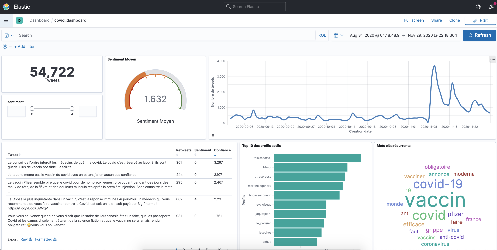

## Deploy a sentiment analysis tool using Elasticsearch and Kibana

### 1- Download sentiment analysis model

The sentiment analysis model used in this project comes from huggingface: it's the `bert-base-multilingual-uncased-sentiment` model. More info about it [here](https://huggingface.co/nlptown/bert-base-multilingual-uncased-sentiment).

To use this model, you'll have to first download its files (binary file and configurations).

Create a `model` folder at the same location of `es_data` (the root of this project) and download pretrained weights and configuration files from huggingface in it.

```bash
mkdir model
cd model
wget https://huggingface.co/nlptown/bert-base-multilingual-uncased-sentiment/resolve/main/config.json
wget https://huggingface.co/nlptown/bert-base-multilingual-uncased-sentiment/blob/main/pytorch_model.bin
wget https://huggingface.co/nlptown/bert-base-multilingual-uncased-sentiment/blob/main/special_tokens_map.json
wget https://huggingface.co/nlptown/bert-base-multilingual-uncased-sentiment/blob/main/tokenizer_config.json
wget https://huggingface.co/nlptown/bert-base-multilingual-uncased-sentiment/blob/main/vocab.txt
```

The folder will be mounted to the container.

### 2- Deploy a Docker-Compose with 3 services

1.  **elasticsearch**: this will start an Elasticsearch container listening at port 9200 with a data folder mounted to es_data

2.  **kibana**: this will start a Kibana container listening at port 5601 and linked to the elasticsearch service

3.  **backend**: this will a container that will upload the initial data to ES

```bash
docker-compose up --build ## ommit the build option if you've already built the images
```

Then visit http://\<public-ip-of-aws-instance>:5601 to access the Kibana.

### 3- Visualize the data on Kibana

When you visit the previous link you won't see the dashboard yet, that's because you have to;

1. configure the index in Kibana

   - Go Management panel
   - Select Stack Management
   - Under the Kibana header, click on Index Patterns
   - You'll see a search bar: type in "tweets" then select it as index

2. upload the objects: visuals and dashboard:
   - Go Management panel
   - Select Stack Management
   - Under the Kibana header, click on Import
   - Pick the `export.ndjson` from the kibana folder and upload it




### 4- Update the database

To run the scraper and update the database

```bash
docker-compose -f docker-compose.crawler.yml up --build
```
